# Chip Data Format

The chips for this competition were derived from Planet's full-frame analytic scene products using our 4-band satellites in sun-synchronous orbit (SSO) and International Space Station (ISS) orbit.  The set of chips for this competition use the [GeoTiff](https://en.wikipedia.org/wiki/GeoTIFF) format and each contain four bands of data: red, green, blue, and near infrared. The specific spectral response of the satellites can be found in the Planet documentation. Each of these channels is in 12 bit digital number format, and meets the specification of the Planet [four band analytic ortho scene product](https://www.planet.com/docs/spec-sheets/sat-imagery/).

For purposes of the competition we have stripped out all of the geotiff information regarding the chip footprint and ground control points (GCPs). The imagery has a ground-sample distance (GSD) of 3.7m and an orthorectified pixel size of 3.125m. The data comes from Planet's Flock 2 satellites in both sun-synchronous and ISS orbits and was collected between January 1, 2016 and February 1, 2017. All of the scenes come from the Amazon basin which includes Brazil, Peru, Uruguay, Colombia, Venezuela, Guyana, Bolivia, and Ecuador (see map below).

We have also included a set of JPG chips for reference and practice. These chips were processed using the Planet [visual product processor](https://www.planet.com/docs/spec-sheets/sat-imagery/#ps-imagery-product) and then saved as jpg chips. These chips are provided as a reference to the scene content, but we expect that the additional information in the tif chips will be more fruitful for the competition.

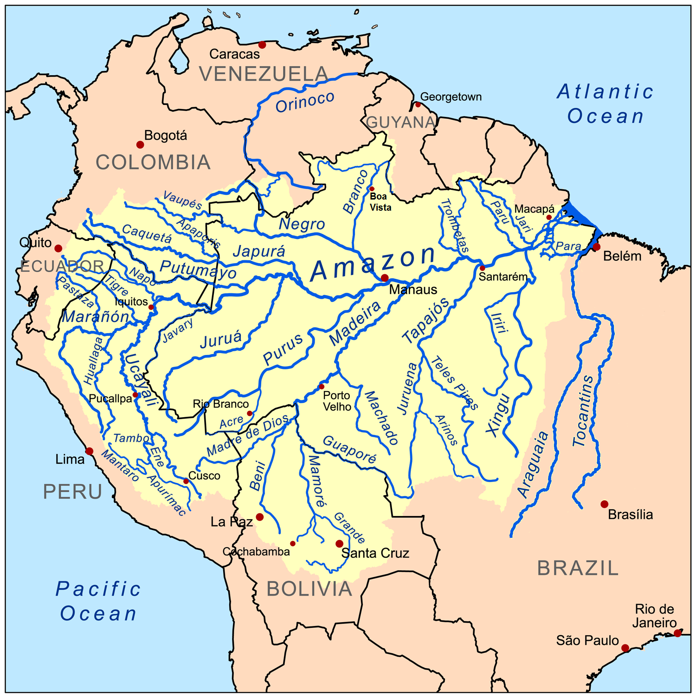

*Above: A map of the Amazon basin.*

# Labeling Process and Data Quality

To assemble this data set we set out with an initial specification of the phenomena we wished to find and include in the final data set. From that initial specification we created a "wish list" of scenes where we included a ballpark number of scenes required to get a sufficient number of chips to demonstrate the phenomena. This initial set of scenes was painstakingly collected by our Berlin team using [Planet Explorer](https://www.planet.com/explorer/). All told this initial set of scenes numbered approximately 1600 and covered a land area of thirty million hectares.

This initial set of scenes was then processed using a custom product processor to create the jpg and 4-band tif chips. Any chip that did not have a full and complete four band product was omitted. This initial set of over 150,000 chips was then divided into two sets, a "hard" and an "easy" set. The easy set contained scenes that the Berlin team identified as having easier-to-identify labels like primary rainforest, agriculture, habitation, roads, water, and cloud conditions. The harder set of data was derived from scenes where the Berlin team had selected for shifting cultivation, slash and burn agriculture, blow down, mining, and other phenomenon.

The chips were labeled using the [Crowd Flower](https://www.crowdflower.com/) platform and a mixture of crowd-sourced labor and our Berlin and San Francisco teams. While the utmost care was taken to get a large and well-labeled dataset, we are aware that not all of the labels in our dataset are correct. Governments around the world retain a large number of highly trained analysts to review images and even they can't always agree on what is present in a given satellite image.

Moreover, the commonly prescribed approach for labeling data in the GIS community is to use actual ground truth data to label scenes, which is both costly and time consuming. With this in mind we do believe our data has a reasonably high signal to noise ratio and is sufficient for training. Given the ease and expediency of crowd labeling, we believe that a large, relatively inexpensive and rapidly labeled dataset is better than a small, more definitive but less diverse dataset. We are interested to see how competitors handle any inaccuracies.

# Class Labels
The class labels for this task were chosen in collaboration with [Planet's Impact team](https://www.planet.com/markets/impact/) and represent a reasonable subset of phenomena of interest in the Amazon basin. The labels can broadly be broken into three groups: atmospheric conditions, common land cover/land use phenomena, and rare land cover/land use phenomena. Each chip will have exactly one atmospheric label and zero or more common and rare labels. Chips that are labeled as cloudy should have no other labels.

*Above: Sample chips and their labels.*

As discussed in the data collection portion of this document, the chip labels are inherently noisy due to the labeling process and ambiguity of features, and scenes may either omit class labels or have incorrect class labels. Part of the challenge of this competition is to figure out how to work with noisy data.

## Cloud Cover Labels
Clouds are a major challenge for passive satellite imaging, and daily cloud cover and rain showers in the Amazon basin can significantly complicate monitoring in the area. For this reason we have chosen to include a cloud cover label for each chip. These labels closely mirror what one would see in a local weather forecast: clear, partly cloudy, cloudy, and haze. For our purposes haze is defined as any chip where atmospheric clouds are visible but they are not so opaque as to obscure the ground. Clear scenes show no evidence of clouds, and partly cloudy scenes can show opaque cloud cover over any portion of the image. Cloudy images have 90% of the chip obscured by opaque cloud cover.

### Examples of Cloudy Scenes

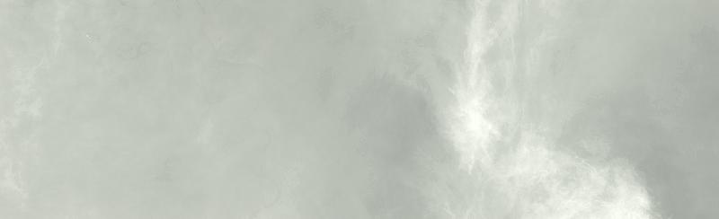

### Examples of Partly Cloudy Scenes

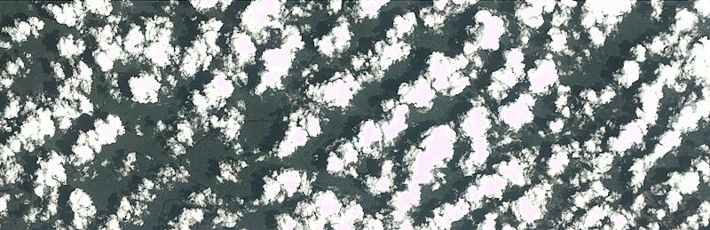

### Examples of Hazy Scenes

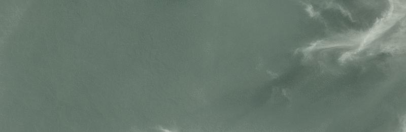

## More Common Labels
The common labels in this data set are rainforest, agriculture, rivers, towns/cities, and roads. Examples of each class are given below.

## Primary Rain Forest
The overwhelming majority of the data set is labeled as "primary", which is shorthand for primary rainforest, or what is known colloquially as virgin forest. Generally speaking, the "primary" label was used for any area that exhibited dense tree cover.[This Mongobay article](http://rainforests.mongabay.com/0103.htm) gives a concise description of the difference between primary and secondary rainforest, but distinguishing between the two is difficult solely using satellite imagery. This is particularly true in older "secondary" forests.
  
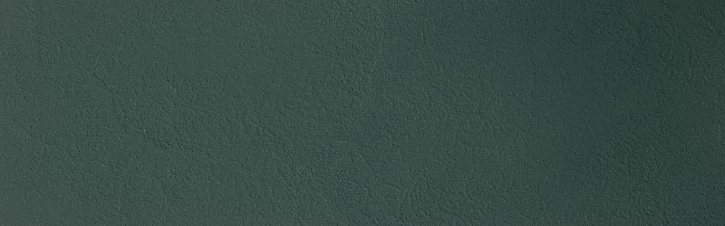

*Above: Approximately 25,000 acres of untouched primary rainforest.*

## Water (Rivers & Lakes)
Rivers, reservoirs, and oxbow lakes are important features of the Amazon basin, and we used the water tag as a catch-all term for these features. Rivers in the Amazon basin [often change course](https://twitter.com/planetlabs/status/789148560323252224) and serve as highways deep into the forest.  The changing course of these rivers [creates new habitat](https://news.mongabay.com/2016/05/keeping-amazon-fish-connected-key-conservation/) but can also [strand endangered Amazon River Dolphins](https://medium.com/planet-stories/rescuing-river-dolphins-with-the-help-of-satellites-1c0d72cf72f5).

*Above: A larger and slower river with significant sand bars. The brown color comes from significant silt deposits.*

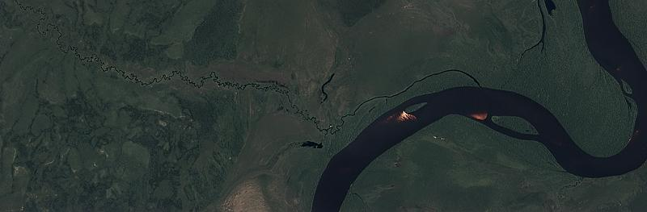

*Above: A small tributary joins a larger river system. The deep brown color of the river is noticeable near the bright sand bars.*

## Habitation
The habitation class label was used for chips that appeared to contain human homes or buildings. This includes anything from dense urban centers to rural villages along the banks of rivers. Small, single-dwelling habitations are often difficult to spot but usually appear as clumps of a few pixels that are bright white.

*Above: A larger city in the Amazon basin.*

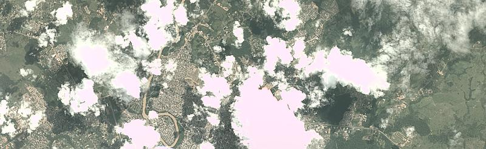

*Above:  A large city.*

## Agriculture
Commercial agriculture, while an important industry, is also a major driver of deforestation in the Amazon. For the purposes of this dataset, agriculture is considered to be any land cleared of trees that is being used for agriculture or [range land](https://rainforestpartnership.org/the-beef-industry-and-deforestation/). 

More reading on agriculture in the Amazon:
* [Sugarcane in Bolivia](https://news.mongabay.com/2016/10/exclusive-rainforest-rapidly-cleared-for-sugarcane-in-bolivia/)
* [Papaya cultivation destroying Peruvian Rainforest](http://maaproject.org/2016/papaya-mdd/)
* [Harvests in Rio Grande do Sul](https://medium.com/planet-stories/a-colorful-harvest-in-rio-grande-do-sul-brazil-46b640eabb50)

*Above: An agricultural area that showing the end state of "fishbone" deforestation.*

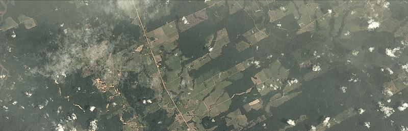

*Above: A newer agricultural area showing "fishbone" deforestation.*

## Road
Roads are important for transportation in the Amazon but they also serve as drivers of deforestation. In particular, "fishbone" deforestation often follows new road construction, while smaller logging roads drive selective logging operations. For our data, all types of roads are labeled with a single "road" label. Some rivers look very similar to smaller logging roads, and consequently there may be some noise in this label. Analysis of the image using the near infrared band may prove useful in disambiguating the two classes.

More information:
* [Roads in the Amazon](https://rainforests.mongabay.com/0814.htm#roads)
* [NASA article on Fishbone Deforestation](https://earthobservatory.nasa.gov/Features/WorldOfChange/deforestation.php)

*Above: classic "Fishbone" deforestation following a road.*

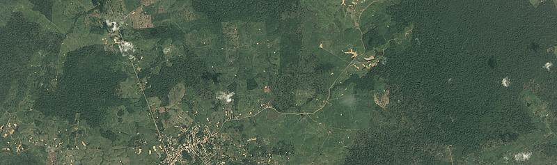

*Above: roads snake out of a small town in the Amazon.*

## Cultivation
Shifting cultivation is a subset of agriculture that is very easy to see from space, and occurs in rural areas where individuals and families maintain farm plots for subsistence. [This article by MongaBay](http://rainforests.mongabay.com/0804.htm) by MongaBay gives a detailed overview of the practice. This type of agriculture is often found near smaller villages along major rivers, and at the outskirts of agricultural areas. It typically relies on non-mechanized labor, and covers relatively small areas.

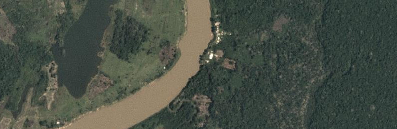

*Above: A zoomed-in area showing cultivation (right side of river)*

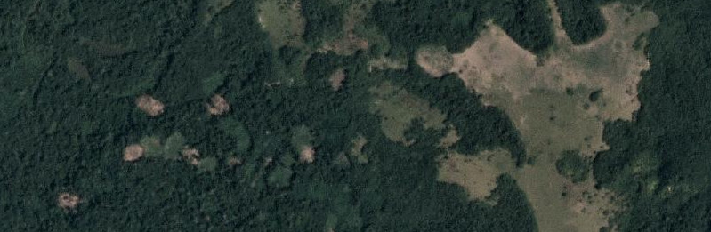

*Above: A zoomed-in area showing cultivation and some selective logging. Dark areas indicate recent slash/burn activity*

## Bare Ground
Bare ground is a catch-all term used for naturally occuring tree free areas that aren't the result of human activity. Some of these areas occur naturally in the Amazon, while others may be the result from the source scenes containing small regions of biome much similar to the [pantanal](https://en.wikipedia.org/wiki/Pantanal) or [cerrado](https://en.wikipedia.org/wiki/Cerrado).

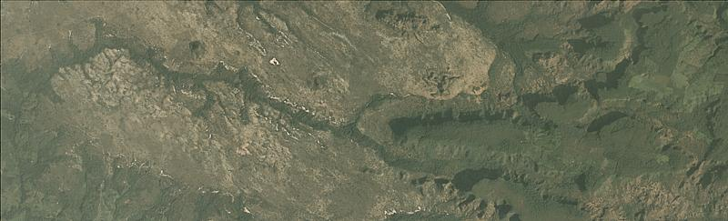

*Above: a naturally occuring bare area in the cerrado.*

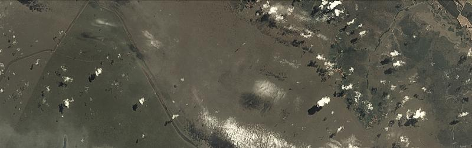

*Above: a naturally occuring bare area in the cerrado.*

# Less Common Labels

## Slash and Burn
Slash-and-burn agriculture can be considered to be a subset of the shifting cultivation label and is used for areas that demonstrate recent burn events. This is to say that the shifting cultivation patches appear to have dark brown or black areas consistent with recent burning.[This NASA Earth Observatory article](https://earthobservatory.nasa.gov/Features/AmazonFire/) gives a good primer on the practice as does [this wikipedia article](https://en.wikipedia.org/wiki/Slash-and-burn).
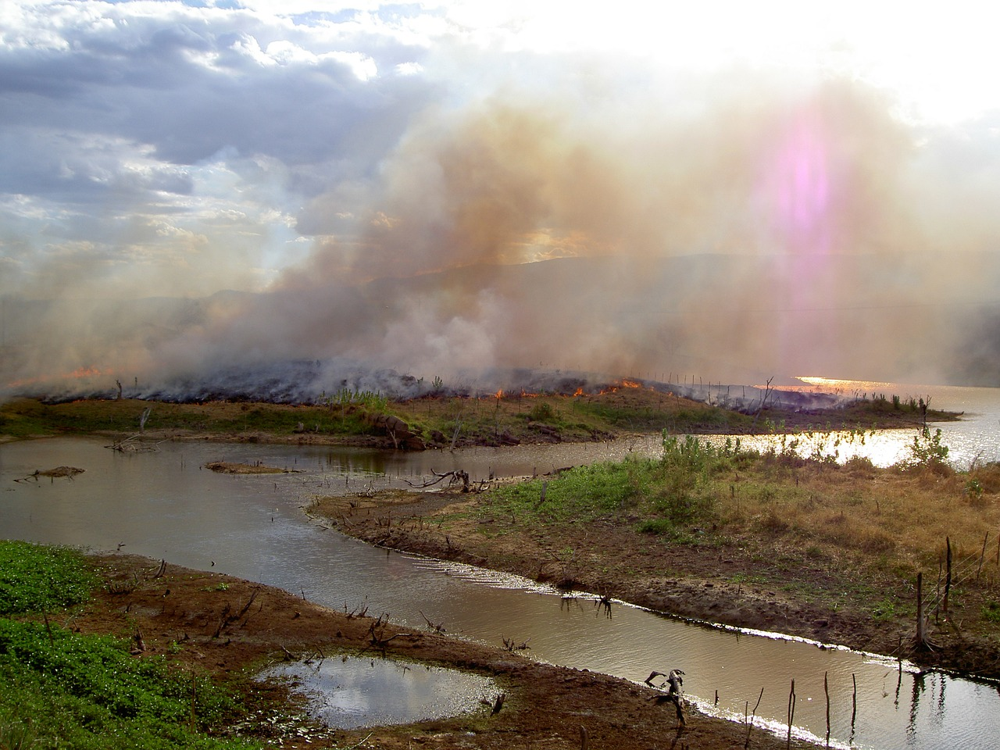
*Above: ground view of slash and burn agriculture. [By Alzenir Ferreira de Souza](https://commons.wikimedia.org/w/index.php?curid=56991110)*

*Above: A zoomed-in view of an area with shifting cultivation with evidence of a recent fire.*

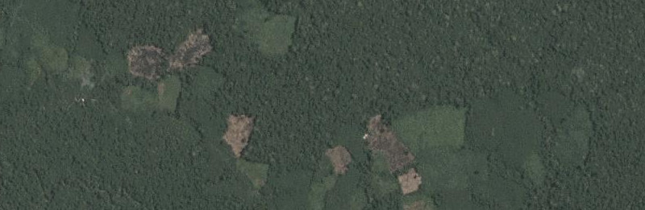

*Above: A zoomed-in view of an area with shifting cultivation and evidence of a recent fire.*

## Selective Logging
The selective logging label is used to cover the practice of selectively removing high value tree species from the rainforest (such as teak and mahogany). From space this appears as winding dirt roads adjacent to bare brown patches in otherwise primary rain forest. This [Mongabay Article](https://rainforests.mongabay.com/0807.htm) covers the details of this process. [Global Forest Watch](http://www.globalforestwatch.org) is another great resource for learning about deforestation and logging.

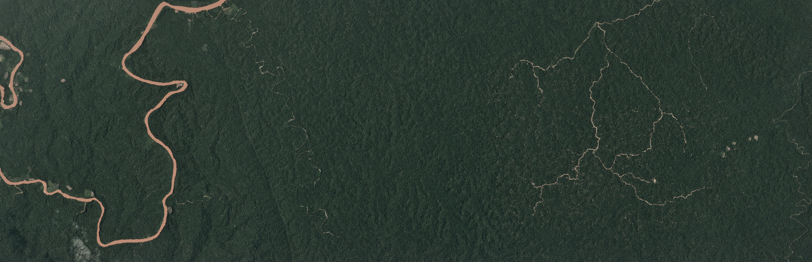

*Above: The brown lines on the right of this scene are a logging road. Note the small brown dots in the area around the road.*

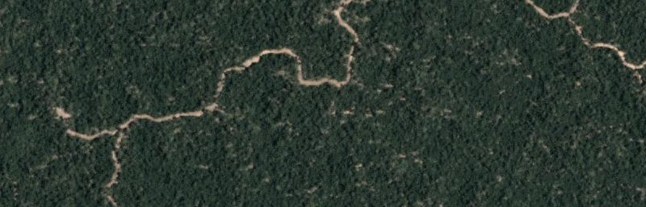

*Above: A zoomed image of logging roads and selective logging.*

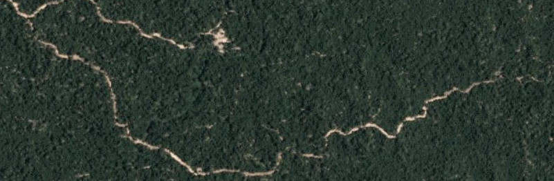

*Above: A zoomed image of logging roads and selective logging.*

## Blooming
Blooming is a natural phenomenon found in the Amazon where particular species of flowering trees bloom, fruit, and flower at the same time to maximize the chances of cross pollination. These trees are quite large and these events can be seen from space. [Planet recently captured a similar event in Panama](https://www.planet.com/gallery/panama-20170328/).

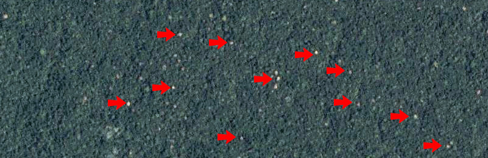

*Above: a zoomed and contrast enhanced of a bloom event in the Amazon basin. The red arrows point to a few specific trees. The canopies of these trees can be over 30m across (~100ft).*

## Conventional Mining
There are a number of large conventional mines in the Amazon basin and the number is [steadily growning](https://www.wsj.com/articles/SB10001424127887324020804578150964211301692). This label is used to classify large-scale legal mining operations. 

*Above: A conventional mine in the Amazon.*

## "Artisinal" Mining
Artisinal mining is a catch-all term for small scale mining operations. Throughout the Amazon, especially at the foothills of the Andes, gold deposits lace the deep, clay soils. Artisanal miners, sometimes [working illegally](https://www.nytimes.com/2016/07/26/world/americas/peru-illegal-gold-mining-latin-america.html?_r=0) in land designated for conservation, slash through the forest and excavate deep pits near rivers. They pump a mud-water slurry into the river banks, blasting them away so that they can be processed further with mercury - which is used to separate out the gold. The denuded moonscape left behind takes centuries to recover.
* [Illegal and artisanal mines in Peru](https://www.planet.com/pulse/illegal-gold-mine-encroaches-on-protected-rainforest/)
* [Images of artisanal mining in Peru](https://www.planet.com/gallery/mining-peru/)
* [MAAP Amazon Report #36](http://maaproject.org/2016/santiago/)
* [MAAP Amazon Report #49](http://maaproject.org/2016/mining_frontiers/)
* [Global Forest Watch article on Mining](http://blog.globalforestwatch.org/gfw-community/partner-posts/partner-post-maap-43-early-warning-deforestation-alerts-in-the-peruvian-amazon-part-2.html)

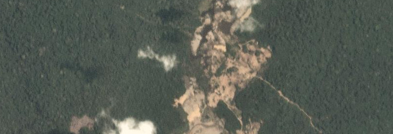

*Above: A zoomed image of an artisanal mine in Peru.*

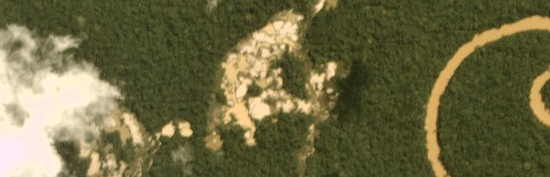

*Above: A zoomed image of an artisanal mine in Peru.*

## Blow Down 
Blow down, also called [windthrow](https://en.wikipedia.org/wiki/Windthrow), is a naturally occurring phenomenon in the Amazon. Briefly, blow down events occur during [microbursts](https://en.wikipedia.org/wiki/Microburst) where cold dry air from the Andes settles on top of warm moist air in the rainforest. The colder air punches a hole in the moist warm layer, and sinks down with incredible force and high speed (in excess of 100MPH). These high winds topple the larger rainforest trees, and the resulting open areas are visible from space. The open areas do not stay visible for along as plants in the understory rush in to take advantage of the sunlight. 

* [MAAP #55: Blow Down Report in Peru Detailed](http://maaproject.org/2017/blowdown2/)
* [MAAP #54: Blow Down Report in Peru](http://maaproject.org/2017/blowdown/)
* [National Geographic Article on Blow Down](http://voices.nationalgeographic.com/2010/07/12/superstorm_killed_half_a_billion_amazon_trees/)
* [Nature article on the size and frequency of blow down events.](https://www.nature.com/articles/ncomms4434)

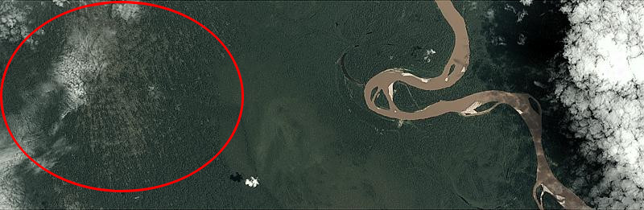

*Above: A recent blow down event in the Amazon circled in red. Note the light green of the forest understory and the pattern of tree loss.*

(C) 2017 Planet
