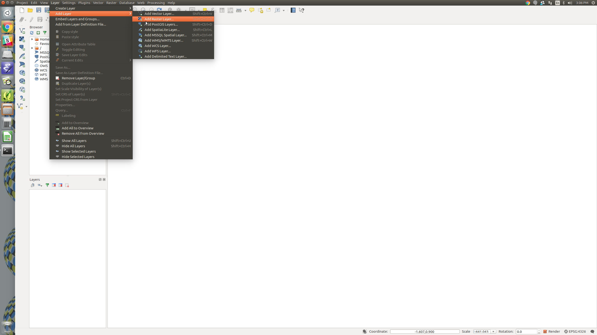
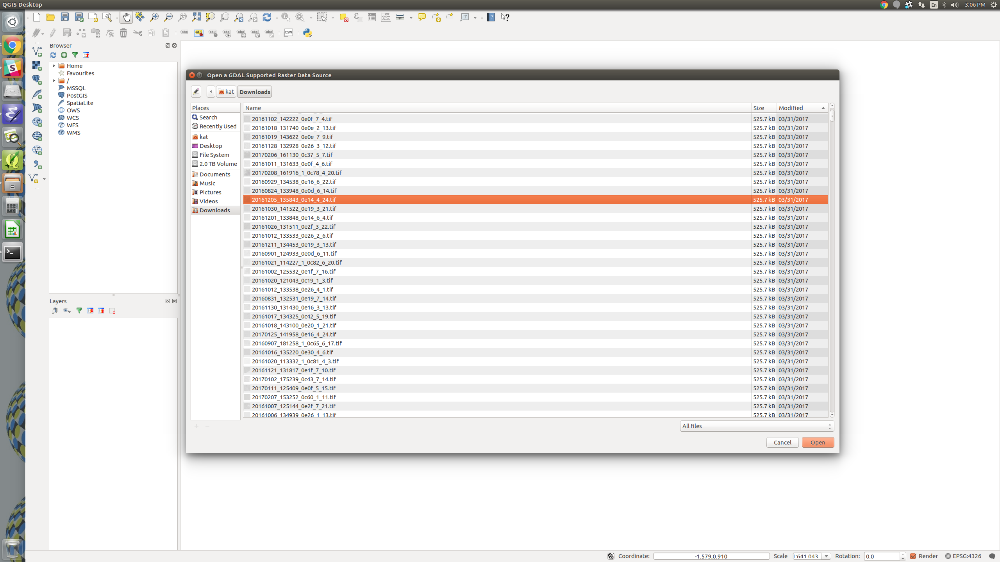
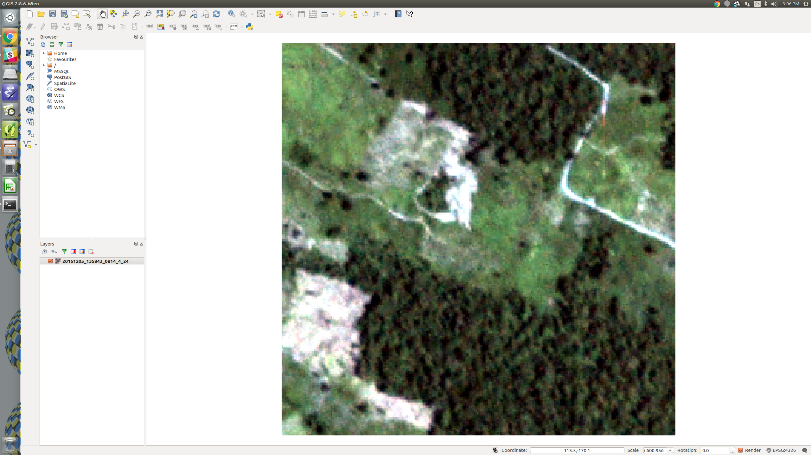
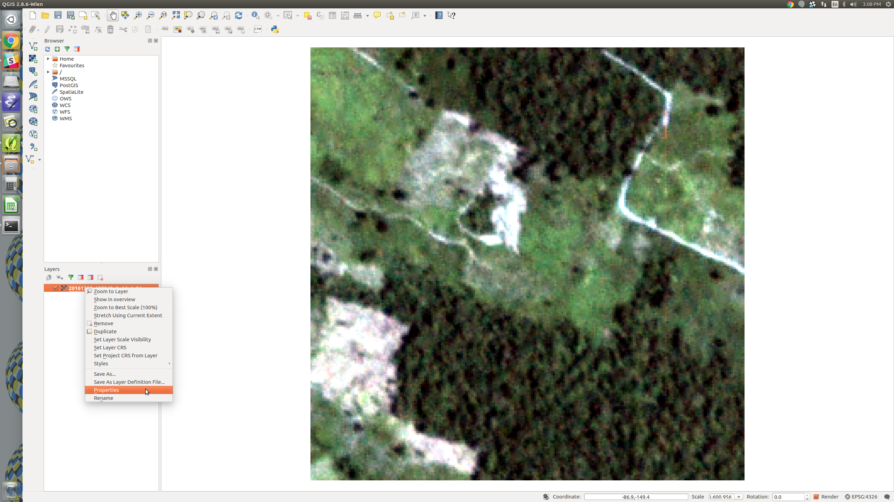
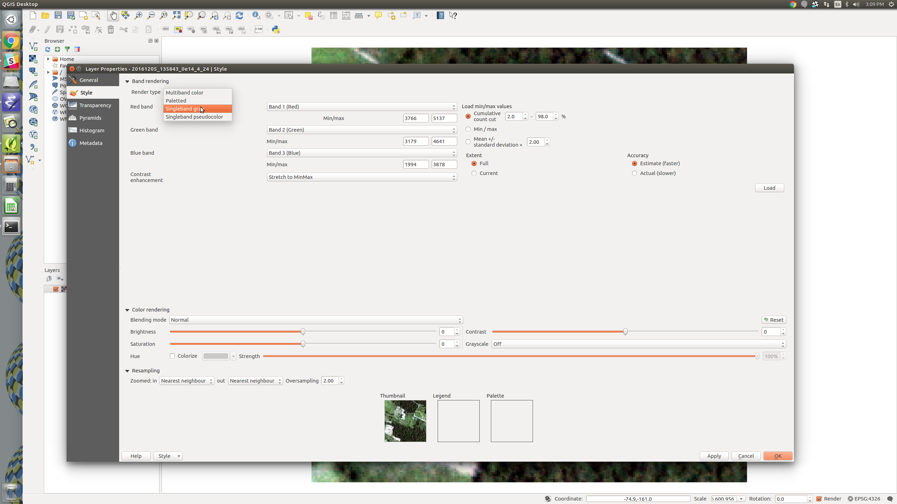
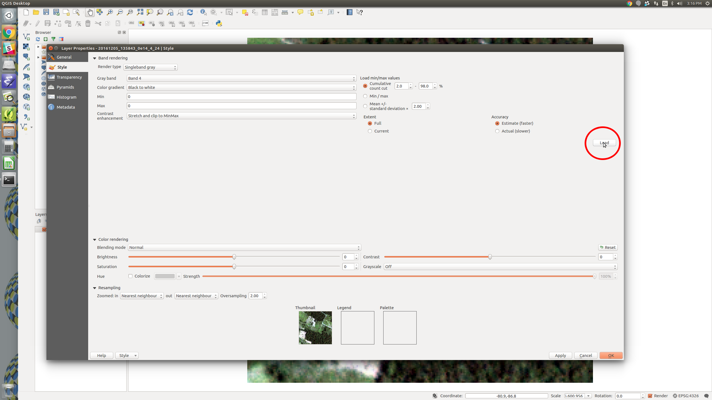
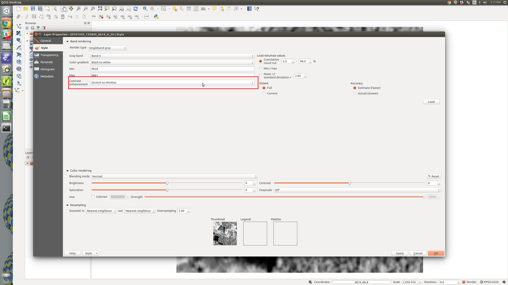
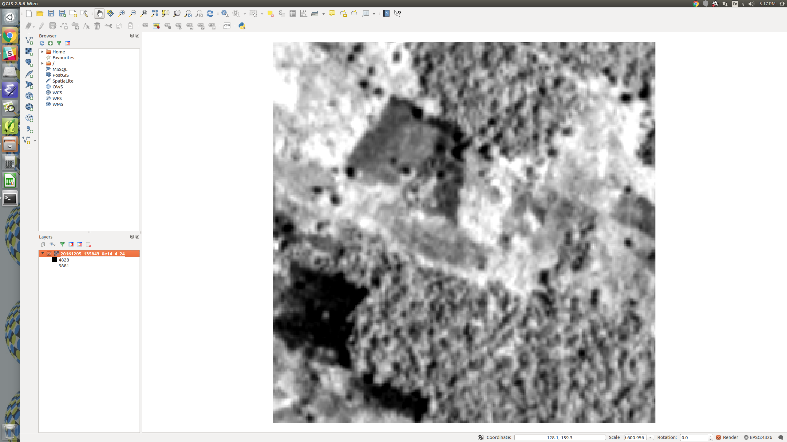

# Quick start Planet Chips and QGIS

QGIS is a free and open source software (FOSS) application that can be used to view GeoTiff files like those found in the Planet data set. It is a cross platform application and can be freely downloaded [using this link](http://www.qgis.org/en/site/forusers/download.html). QGIS makes it easy to view multi-band high resolution map data files. QGIS has extensive documentation and tutorials. Some of which can be [found here](http://www.qgistutorials.com/).  

## Visualizing NIR Bands

Open up QGIS. To view a chip click on Layer->Add Layer->Add Raster Layer.

A dialog should pop up where you can select one or more chips. Select your chip and and hit open in the bottom right.

You should now be able to see your chip.

Now, to view the alpha band, look in the layers dialog in the bottom right of QGIS.  Right click on your chip and select properties.

A dialog should pop up. We are going to look at the IR band in isolation. In the render type dialog click "Singleband Gray."

Now we will set our input to IR. Just below the "render type" dialog findthe gray band dialog, select "Band 4". This is the IR band for our tif file.

 band.")

To make the image easier to understand we need to scale our color space so we use all of the possible gray values. The first step is to load the min and max IR values of the image. Click load in the middle right of the dialog (circled in red below). The min and max values should appear.

Now, under the contrast enhancement drop down select "Stretch to Min/Max".

Now select "Okay in the lower right corner."

The IR band should now be visible. 

